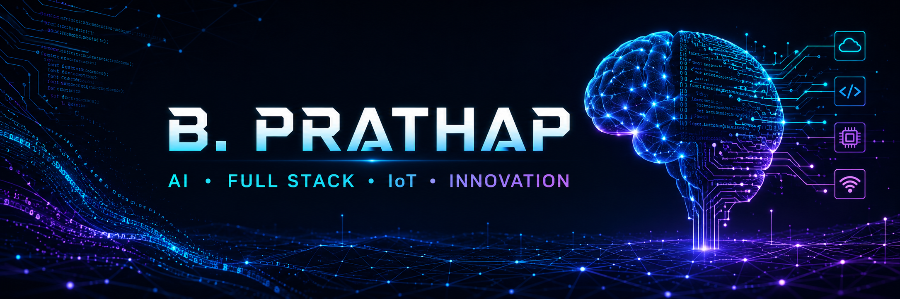

<h1>Hi 👋, I'm B. Prathap</h1>

<h3>AI & Data Science Engineer • Full-Stack Developer • AI Research Enthusiast • IoT Innovator</h3>

Building intelligent systems that solve real-world problems through AI, networking, and software engineering.

🚀 About Me

name: B. Prathap
education: B.Tech — Artificial Intelligence & Data Science
institute: St. Joseph's Institute of Technology, Chennai
focus: [Artificial Intelligence, Full-Stack Development, IoT, Product Engineering]
currently_building: RescueMesh
currently_learning: [Advanced Java, DSA, System Design, AI Agents, Cloud Computing]
mission: Build technology that creates measurable impact at scale

💡 I convert real-world problems into practical, demo-ready products.

🤖 My interests include AI/ML, full-stack development, Android, networking, and embedded IoT.

🚀 I actively participate in hackathons, internships, and project expos.

🤝 I’m open to collaborating on AI, disaster-tech, health-tech, and ed-tech projects.

🛠️ Tech Stack

Languages

AI, Data & Backend

Development, Cloud & IoT

🌟 Featured Projects

Project

Description

Technology

🚑 RescueMesh

Decentralized emergency communication when cellular networks fail

Kotlin, Android, ESP32, BLE Mesh, LoRa

🌊 FloodTwin

AI-powered urban flood prediction, monitoring, and safer-route analysis

Python, Machine Learning, Full Stack

🌿 Plant Disease Detection

Identifies plant diseases from images using deep learning

Python, TensorFlow, OpenCV

🧠 MindMate AI

Accessible AI mental-health support assistant

AI/NLP, JavaScript, Backend APIs

💊 Medicine Identifier

Recognizes medicines and presents identification details

Computer Vision, OCR, Web Development

📊 HackFlow

Manages hackathon teams, submissions, workflows, and evaluation

Full-Stack Development, Database

  

🏆 Highlights & Current Mission

<table>
<tr>
<td width="50%" valign="top">

Achievements

🏆 Best Project Award at Innoverse Project Expo

🚀 Top 10 Finalist at HackIndia

💼 Multiple industry internships

🧩 1,000+ programming problems solved

🎓 NPTEL Elite — Python for Data Science

</td>
<td width="50%" valign="top">

Current Mission

🚑 Develop the production version of RescueMesh

🌊 Advance the FloodTwin platform

🧠 Build capable AI agents and products

⚙️ Strengthen DSA and system design

☁️ Explore cloud deployment

🤝 Contribute to open source

</td>
</tr>
</table>

📈 Development Focus

“The best way to predict the future is to build it.”

Designed with curiosity, consistency, and a focus on real-world impact.

